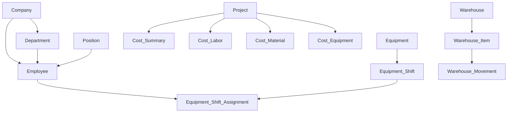

# 🗄️ Schema الكامل - التوثيق

## 📋 نظرة عامة

هذا المجلد يحتوي على ملف `schema.prisma` الموحد الذي يجمع جميع الأنظمة في مكان واحد.

---

## 📚 المحتويات

### 1. **schema.prisma** (سيتم إضافته)
**الوصف:** ملف Schema الموحد الكامل

**يحتوي على:**
- ✅ جميع الجداول من كل الأنظمة
- ✅ العلاقات الكاملة بين الجداول
- ✅ Indexes محسّنة للأداء
- ✅ تعليقات توضيحية لكل جدول
- ✅ Enums وTypes المستخدمة

**الأنظمة المضمنة:**
1. النظام الأساسي (Company, Department, Position)
2. نظام الموظفين (40+ حقل)
3. نظام المعدات (10 جداول)
4. نظام المخازن (10 جداول)
5. نظام التكاليف (7 جداول)
6. نظام المشاريع

---

### 2. **migrations_guide.md**
**الوصف:** دليل شامل للـ Migrations

**يحتوي على:**
- أوامر Prisma الأساسية
- كيفية إنشاء Migration جديد
- التراجع عن Migration
- حل مشاكل Migrations الشائعة

---

## 🚀 البدء السريع

### الخطوة 1: نسخ Schema
```bash
# انسخ محتوى schema.prisma إلى مشروعك
cp schema.prisma ../../prisma/schema.prisma
```

### الخطوة 2: التحقق من الصحة
```bash
npx prisma validate
```

### الخطوة 3: إنشاء Migration
```bash
npx prisma migrate dev --name initial_setup
```

### الخطوة 4: توليد Prisma Client
```bash
npx prisma generate
```

### الخطوة 5: فتح Prisma Studio
```bash
npx prisma studio
```

---

## 📊 إحصائيات Schema

```
إجمالي الجداول: 50+ جدول
إجمالي الحقول: 500+ حقل
إجمالي العلاقات: 100+ علاقة
إجمالي Indexes: 80+ index
```

---

## 🔗 العلاقات الرئيسية



---

## 📝 أمثلة استخدام

### مثال 1: استعلام بسيط
```typescript
const employees = await prisma.employee.findMany({
  where: { isActive: true },
  include: {
    company: true,
    department: true,
    position: true
  }
});
```

### مثال 2: استعلام معقد
```typescript
const projectCosts = await prisma.project.findUnique({
  where: { id: 1 },
  include: {
    costSummary: true,
    laborCosts: {
      include: {
        employee: {
          select: { fullName: true, position: true }
        }
      }
    },
    materialCosts: {
      include: {
        item: true
      }
    },
    equipmentCosts: {
      include: {
        equipment: true
      }
    }
  }
});
```

---

## ⚠️ ملاحظات مهمة

### قبل تطبيق Schema:
1. ✅ **احفظ نسخة احتياطية** من قاعدة البيانات الحالية
2. ✅ **اختبر على بيئة تطوير** أولاً
3. ✅ **راجع الـ Migration** قبل التطبيق
4. ✅ **تأكد من صحة العلاقات**

### بعد تطبيق Schema:
1. ✅ **راجع Prisma Studio** للتحقق من الجداول
2. ✅ **اختبر العلاقات** بينها
3. ✅ **أضف بيانات تجريبية** (Seed)
4. ✅ **اختبر الأداء** مع Indexes

---

## 🔧 الصيانة

### تحديث Schema:
```bash
# عند تعديل schema.prisma
npx prisma format          # تنسيق الملف
npx prisma validate        # التحقق من الصحة
npx prisma migrate dev     # إنشاء migration جديد
```

### حل المشاكل:
```bash
# إعادة تعيين قاعدة البيانات (⚠️ يحذف كل البيانات)
npx prisma migrate reset

# حالة Migrations
npx prisma migrate status

# تطبيق migrations معلقة
npx prisma migrate deploy
```

---

## 📊 الأداء

### Indexes الموصى بها:
```prisma
// على الجداول الكبيرة
@@index([companyId])
@@index([departmentId])
@@index([projectId])
@@index([date])
@@index([isActive])

// Compound Indexes
@@index([companyId, isActive])
@@index([projectId, date])
```

### نصائح للأداء:
- استخدم `select` بدلاً من جلب كل الحقول
- استخدم `include` فقط للعلاقات المطلوبة
- استخدم Pagination للقوائم الكبيرة
- فعّل Connection Pooling

---

## 🔗 روابط ذات صلة

- [نظام الموظفين](../01_نظام_الموظفين/)
- [نظام المعدات](../02_نظام_المعدات/)
- [نظام المخازن](../03_نظام_المخازن/)
- [نظام التكاليف](../04_نظام_حساب_التكاليف/)
- [البيانات الأساسية](../05_البيانات_الأساسية/)
- [العودة لقواعد البيانات](../README.md)

---

## 📞 الدعم

للمساعدة في Schema:
- [Prisma Documentation](https://www.prisma.io/docs)
- [أوامر Prisma](../../50_أدلة_عملية/03_أوامر_Prisma_والصيانة.md)
- [الأعطال الشائعة](../../30_التشغيل_والنشر/02_الأعطال_الشائعة.md)

---

**الحالة:** 🔄 قيد التجميع  
**آخر تحديث:** أكتوبر 2025
