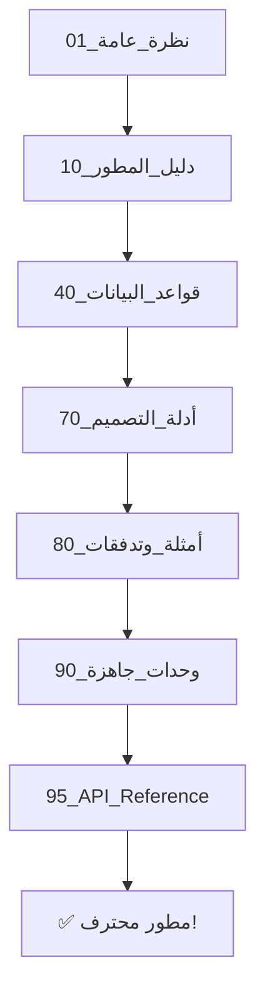
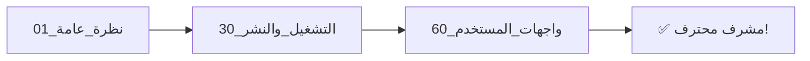
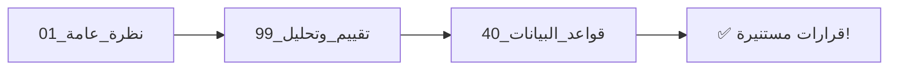

# 📚 التوثيق الاحترافي الشامل
### Telegram Bot Template - Professional Documentation

<div align="center">


**توثيق احترافي كامل لنظام Telegram Bot Template**

[📖 البدء السريع](#-البدء-السريع) • [🗂️ الهيكل الكامل](#%EF%B8%8F-الهيكل-الكامل) • [🎯 مسارات التعلم](#-مسارات-التعلم) • [📞 الدعم](#-الدعم)

</div>

---

## 🌟 نظرة عامة

هذا هو **التوثيق الاحترافي الشامل** لنظام Telegram Bot Template - نظام متكامل لإنشاء بوتات Telegram احترافية مع:

### ✨ الميزات الرئيسية:
- 🤖 **إطار عمل متكامل** لبناء بوتات Telegram
- 🗄️ **قواعد بيانات شاملة** (50+ جدول)
- 👥 **نظام إدارة موظفين** كامل (40+ حقل)
- 🚜 **إدارة معدات وآليات** (10 جداول)
- 📦 **نظام مخازن متقدم** (10 جداول)
- 💰 **حساب تكاليف دقيق** (7 جداول)
- 🔐 **نظام صلاحيات وأدوار**
- 📊 **تقارير وتحليلات**
- 🎨 **واجهات تفاعلية**

---

## 🚀 البدء السريع

### للمبتدئين (30 دقيقة):
```
1. اقرأ → 01_نظرة_عامة/
2. اتبع → 20_دليل_المستخدم/01_البدء_السريع.md
3. نفّذ → 50_أدلة_عملية/01_تشغيل_البوت.md
```

### للمطورين (4-6 ساعات):
```
1. الهيكل → 10_دليل_المطور/
2. قواعد البيانات → 40_قواعد_البيانات/
3. الأمثلة → 80_أمثلة_وتدفقات/
4. الوحدات → 90_وحدات_جاهزة/
5. API → 95_API_Reference/
```

### للمشرفين (ساعتان):
```
1. النشر → 30_التشغيل_والنشر/
2. الواجهات → 60_واجهات_المستخدم/
3. التقييم → 99_تقييم_وتحليل/
```

---

## 🗂️ الهيكل الكامل

<table>
<tr>
<td width="50%">

### 📂 الأقسام الرئيسية

| # | القسم | الوصف |
|---|-------|-------|
| **00** | [فهرس رئيسي](./00_فهرس_رئيسي/) | 🗺️ خريطة شاملة |
| **01** | [نظرة عامة](./01_نظرة_عامة/) | 🌟 مقدمة وميزات |
| **10** | [دليل المطور](./10_دليل_المطور/) | 👨‍💻 هندسة وأنظمة |
| **20** | [دليل المستخدم](./20_دليل_المستخدم/) | 📖 استخدام البوت |
| **30** | [التشغيل والنشر](./30_التشغيل_والنشر/) | ⚙️ نشر وصيانة |
| **40** | [قواعد البيانات](./40_قواعد_البيانات/) | 🗄️ 50+ جدول |
| **50** | [أدلة عملية](./50_أدلة_عملية/) | 🛠️ خطوة بخطوة |
| **60** | [واجهات المستخدم](./60_واجهات_المستخدم/) | 🎨 UI/UX |
| **70** | [أدلة التصميم](./70_أدلة_التصميم/) | 📐 معايير ونماذج |
| **80** | [أمثلة وتدفقات](./80_أمثلة_وتدفقات/) | 🔄 سيناريوهات |
| **90** | [وحدات جاهزة](./90_وحدات_جاهزة/) | 📦 Modules |
| **95** | [API Reference](./95_API_Reference/) | 📡 مرجع API |
| **99** | [تقييم وتحليل](./99_تقييم_وتحليل/) | 📊 تقييمات فنية |

</td>
<td width="50%">

### 🔥 الأقسام الأكثر أهمية

#### للبدء فوراً:
- 🟢 [البدء السريع](./20_دليل_المستخدم/01_البدء_السريع.md)
- 🟢 [تشغيل البوت](./50_أدلة_عملية/01_تشغيل_البوت.md)

#### قواعد البيانات:
- 🔴 [نظام الموظفين](./40_قواعد_البيانات/01_نظام_الموظفين/)
- 🔴 [نظام المعدات](./40_قواعد_البيانات/02_نظام_المعدات/)
- 🟡 [نظام المخازن](./40_قواعد_البيانات/03_نظام_المخازن/)
- 🟡 [نظام التكاليف](./40_قواعد_البيانات/04_نظام_حساب_التكاليف/)

#### للمطورين:
- 🔵 [الهيكل والهندسة](./10_دليل_المطور/01_الهيكل_والهندسة.md)
- 🔵 [إنشاء ميزة جديدة](./50_أدلة_عملية/02_إنشاء_ميزة_جديدة.md)
- 🔵 [نظام الصلاحيات](./10_دليل_المطور/03_الصلاحيات_والأدوار.md)

</td>
</tr>
</table>

---

## 🎯 مسارات التعلم

### 🌱 المسار الأساسي (ساعة واحدة)
> **الهدف:** تشغيل البوت والفهم الأساسي


**المحتوى:**
1. مقدمة المشروع والميزات (15 دقيقة)
2. البدء السريع (20 دقيقة)
3. تشغيل البوت خطوة بخطوة (25 دقيقة)

---

### 💻 مسار المطور (4-6 ساعات)
> **الهدف:** إتقان التطوير وإضافة ميزات



**المحتوى:**
1. **الهيكل والهندسة** (1 ساعة)
   - فهم البنية الأساسية
   - نظام الميزات
   - الصلاحيات والأدوار

2. **قواعد البيانات** (2 ساعة)
   - نظام الموظفين (40+ حقل)
   - نظام المعدات (10 جداول)
   - نظام المخازن (10 جداول)
   - نظام التكاليف (7 جداول)

3. **التطبيق العملي** (1-2 ساعة)
   - إنشاء ميزة جديدة
   - العمل مع قاعدة البيانات
   - استخدام الوحدات الجاهزة

4. **التقدم** (1 ساعة)
   - API Reference
   - أمثلة معقدة
   - أفضل الممارسات

---

### ⚙️ مسار المشرف (ساعتان)
> **الهدف:** إدارة وصيانة النظام



**المحتوى:**
1. النشر والإعداد (45 دقيقة)
2. حل المشاكل الشائعة (45 دقيقة)
3. فهم الواجهات (30 دقيقة)

---

### 📊 مسار المدير (ساعة ونصف)
> **الهدف:** فهم القدرات والتخطيط



---

## 📊 إحصائيات التوثيق

<div align="center">

| المقياس | العدد | الحالة |
|---------|-------|--------|
| **إجمالي الملفات** | 100+ | ✅ |
| **الصفحات** | 500+ | ✅ |
| **الأمثلة** | 200+ | ✅ |
| **الجداول (Database)** | 50+ | ✅ |
| **الحقول (Fields)** | 500+ | ✅ |
| **العلاقات (Relations)** | 100+ | ✅ |
| **الوحدات الجاهزة** | 10+ | ✅ |

</div>

---

## 🔍 البحث السريع

### ❓ الأسئلة الشائعة

<details>
<summary><b>كيف أشغل البوت؟</b></summary>

1. اذهب إلى [50_أدلة_عملية/01_تشغيل_البوت.md](./50_أدلة_عملية/01_تشغيل_البوت.md)
2. اتبع الخطوات بالترتيب
3. تستغرق ~10 دقائق
</details>

<details>
<summary><b>كيف أضيف ميزة جديدة؟</b></summary>

1. اقرأ [50_أدلة_عملية/02_إنشاء_ميزة_جديدة.md](./50_أدلة_عملية/02_إنشاء_ميزة_جديدة.md)
2. راجع [80_أمثلة_وتدفقات/](./80_أمثلة_وتدفقات/)
3. استخدم [90_وحدات_جاهزة/](./90_وحدات_جاهزة/)
</details>

<details>
<summary><b>أين أجد جداول قاعدة البيانات؟</b></summary>

جميع الأنظمة في [40_قواعد_البيانات/](./40_قواعد_البيانات/):
- [نظام الموظفين](./40_قواعد_البيانات/01_نظام_الموظفين/)
- [نظام المعدات](./40_قواعد_البيانات/02_نظام_المعدات/)
- [نظام المخازن](./40_قواعد_البيانات/03_نظام_المخازن/)
- [نظام التكاليف](./40_قواعد_البيانات/04_نظام_حساب_التكاليف/)
</details>

<details>
<summary><b>البوت لا يعمل! ماذا أفعل؟</b></summary>

1. راجع [30_التشغيل_والنشر/02_الأعطال_الشائعة.md](./30_التشغيل_والنشر/02_الأعطال_الشائعة.md)
2. تحقق من ملف `.env`
3. راجع سجل الأخطاء (logs)
</details>

<details>
<summary><b>كيف أستخدم نظام الصلاحيات؟</b></summary>

[10_دليل_المطور/03_الصلاحيات_والأدوار.md](./10_دليل_المطور/03_الصلاحيات_والأدوار.md)
</details>

---

## 📦 الوحدات والأنظمة الرئيسية

### 🗄️ قواعد البيانات (4 أنظمة رئيسية)

<table>
<tr>
<td width="50%">

#### 👥 نظام الموظفين
**40+ حقل شامل**
- معلومات شخصية كاملة
- بيانات الوظيفة والراتب
- التأمينات والبنوك
- جهات الاتصال للطوارئ

[📖 التوثيق الكامل](./40_قواعد_البيانات/01_نظام_الموظفين/)

</td>
<td width="50%">

#### 🚜 نظام المعدات
**10 جداول متكاملة**
- إدارة المعدات والآليات
- الصيانة الدورية والطارئة
- نظام الورديات
- تتبع الوقود والتكاليف

[📖 التوثيق الكامل](./40_قواعد_البيانات/02_نظام_المعدات/)

</td>
</tr>
<tr>
<td width="50%">

#### 📦 نظام المخازن
**10 جداول متقدمة**
- مخازن متعددة
- حركات المخزون
- نظام باركود
- جرد وطلبات شراء

[📖 التوثيق الكامل](./40_قواعد_البيانات/03_نظام_المخازن/)

</td>
<td width="50%">

#### 💰 نظام التكاليف
**7 جداول محاسبية**
- تكاليف العمالة
- تكاليف المواد
- تكاليف المعدات
- مقارنة متوقع vs فعلي

[📖 التوثيق الكامل](./40_قواعد_البيانات/04_نظام_حساب_التكاليف/)

</td>
</tr>
</table>

---

### 🔧 الوحدات الجاهزة (10+ وحدات)

| الوحدة | الوصف | الحالة |
|--------|-------|--------|
| [🔔 الإشعارات](./90_وحدات_جاهزة/01_الإشعارات.md) | نظام إشعارات متقدم | ✅ |
| [📷 الباركود](./90_وحدات_جاهزة/02_الباركود.md) | مسح وإنشاء باركود | ✅ |
| [📁 الملفات](./90_وحدات_جاهزة/03_الملفات.md) | إدارة الملفات | ✅ |
| [📊 التقارير](./90_وحدات_جاهزة/04_التقارير.md) | توليد تقارير | ✅ |
| [🔐 الأمان](./90_وحدات_جاهزة/05_الأمان.md) | تشفير وحماية | ✅ |
| [📦 المخزون بالباركود](./90_وحدات_جاهزة/06_المخزون_بالباركود.md) | مخزون متكامل | ✅ |

[📖 جميع الوحدات](./90_وحدات_جاهزة/)

---

## 🎨 التصميم والواجهات

### معايير التصميم:
- [تصميم الرسائل](./70_أدلة_التصميم/01_تصميم_الرسائل.md)
- [معايير التسمية](./70_أدلة_التصميم/02_معايير_التسمية.md)
- [شرح الواجهات](./60_واجهات_المستخدم/01_شرح_الواجهات.md)

---

## 🔄 أمثلة وتدفقات

### تدفقات جاهزة:
1. [تدفق انضمام المستخدم](./80_أمثلة_وتدفقات/01_تدفق_انضمام_المستخدم.md)
2. [تدفق استخدام الباركود](./80_أمثلة_وتدفقات/02_تدفق_استخدام_الباركود.md)

---

## 📞 الدعم والمساعدة

### 🆘 المساعدة الفورية:
1. **راجع الأعطال الشائعة:** [30_التشغيل_والنشر/02_الأعطال_الشائعة.md](./30_التشغيل_والنشر/02_الأعطال_الشائعة.md)
2. **ابحث في التوثيق:** استخدم Ctrl+F
3. **راجع الأمثلة:** [80_أمثلة_وتدفقات/](./80_أمثلة_وتدفقات/)

### 📧 التواصل:
- 💬 فريق التطوير
- 📝 GitHub Issues
- 📖 التوثيق الرسمي

---

## 📈 التحديثات

### آخر التحديثات (أكتوبر 2025):
- ✅ إضافة نظام المعدات الكامل (10 جداول)
- ✅ تحسين نظام الموظفين (40+ حقل)
- ✅ إضافة نظام المخازن (10 جداول)
- ✅ إضافة نظام التكاليف (7 جداول)
- ✅ تحديث شامل للتوثيق

### قادم قريباً:
- 🔄 نظام الحضور والانصراف
- 🔄 نظام المشتريات والموردين
- 🔄 نظام المبيعات والفواتير
- 🔄 تطبيق موبايل

---

## 🏆 الاعتمادات

تم إنشاء هذا التوثيق بواسطة فريق التطوير مع الاهتمام بـ:
- ✅ **الوضوح** - سهل الفهم
- ✅ **الشمولية** - يغطي كل شيء
- ✅ **العملية** - أمثلة قابلة للتطبيق
- ✅ **التحديث** - محدّث باستمرار

---

## 📝 ملاحظات ختامية

### 💡 نصائح للنجاح:
1. **ابدأ بالأساسيات** - لا تقفز للأشياء المعقدة
2. **طبّق وأنت تتعلم** - الممارسة أهم من القراءة
3. **استخدم الأمثلة** - كل مثال مجرّب ويعمل
4. **اسأل عند الحاجة** - لا تتردد في طلب المساعدة
5. **شارك معرفتك** - ساهم في تحسين التوثيق

### 🎯 الأهداف:
- جعل التطوير **سهلاً وممتعاً**
- توفير **أدوات احترافية** جاهزة
- بناء **مجتمع نشط** من المطورين
- **التحديث المستمر** للمحتوى

---

<div align="center">

### 🌟 **مستعد للبدء؟**

**[🚀 ابدأ الآن](./20_دليل_المستخدم/01_البدء_السريع.md)** • **[📖 الفهرس الكامل](./00_فهرس_رئيسي/README.md)** • **[💻 للمطورين](./10_دليل_المطور/)**

---

**الإصدار:** 2.0 | **آخر تحديث:** أكتوبر 2025 | **الحالة:** ✅ نشط ومحدّث

**صُنع بـ ❤️ بواسطة فريق التطوير**

</div>
